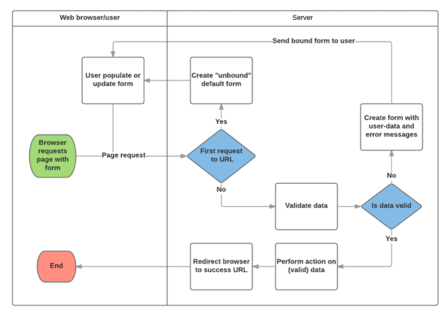

# Django CRUD and Forms


## HTML Forms

```

<form action="/team_name_url/" method="post">
    <label for="team_name">Enter name: </label>
    <input id="team_name" type="text" name="name_field" value="Default name for team.">
    <input type="submit" value="OK">
</form>

```

##### Trust The Process



#### Declaring a form

```

from django import forms

class RenewBookForm(forms.Form):
    renewal_date = forms.DateField(help_text="Enter a date between now and 4 weeks (default 3).")

```

#### Validations

```

import datetime

from django import forms
from django.core.exceptions import ValidationError
from django.utils.translation import ugettext_lazy as _

class RenewBookForm(forms.Form):
    renewal_date = forms.DateField(help_text="Enter a date between now and 4 weeks (default 3).")

    def clean_renewal_date(self):
        data = self.cleaned_data['renewal_date']

        # Check if a date is not in the past.
        if data < datetime.date.today():
            raise ValidationError(_('Invalid date - renewal in past'))

        # Check if a date is in the allowed range (+4 weeks from today).
        if data > datetime.date.today() + datetime.timedelta(weeks=4):
            raise ValidationError(_('Invalid date - renewal more than 4 weeks ahead'))

        # Remember to always return the cleaned data.
        return data

```

#### URL config
> The URL configuration will redirect URLs with the format /catalog/book/<bookinstance_id>/renew/ to the function named renew_book_librarian() in views.py, and send the BookInstance id as the parameter named pk. The pattern only matches if pk is a correctly formatted uuid.


```

urlpatterns += [
    path('book/<uuid:pk>/renew/', views.renew_book_librarian, name='renew-book-librarian'),
]

```

### View and some CRUD

```

import datetime

from django.shortcuts import render, get_object_or_404
from django.http import HttpResponseRedirect
from django.urls import reverse

from catalog.forms import RenewBookForm

def renew_book_librarian(request, pk):
    book_instance = get_object_or_404(BookInstance, pk=pk)

    # If this is a POST request then process the Form data
    if request.method == 'POST':

        # Create a form instance and populate it with data from the request (binding):
        form = RenewBookForm(request.POST)

        # Check if the form is valid:
        if form.is_valid():
            # process the data in form.cleaned_data as required (here we just write it to the model due_back field)
            book_instance.due_back = form.cleaned_data['renewal_date']
            book_instance.save()

            # redirect to a new URL:
            return HttpResponseRedirect(reverse('all-borrowed') )

    # If this is a GET (or any other method) create the default form.
    else:
        proposed_renewal_date = datetime.date.today() + datetime.timedelta(weeks=3)
        form = RenewBookForm(initial={'renewal_date': proposed_renewal_date})

    context = {
        'form': form,
        'book_instance': book_instance,
    }

    return render(request, 'catalog/book_renew_librarian.html', context)

```

###### Warning
> While you can also access the form data directly through the request (for example, `request.POST['renewal_date']` or `request.GET['renewal_date']` if using a GET request), this is NOT recommended. The cleaned data is sanitized, validated, and converted into Python-friendly types.

###### Credits
<!-- https://developer.mozilla.org/en-US/docs/Learn/Server-side/Django/Forms -->


[<== Back](README.md)
